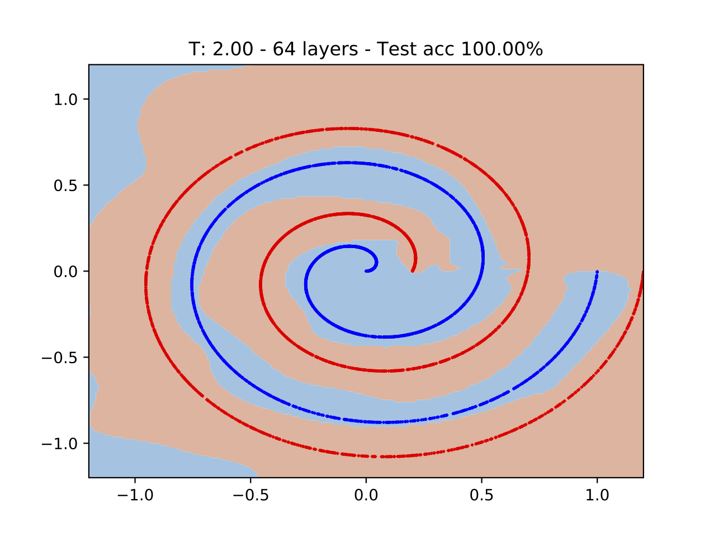
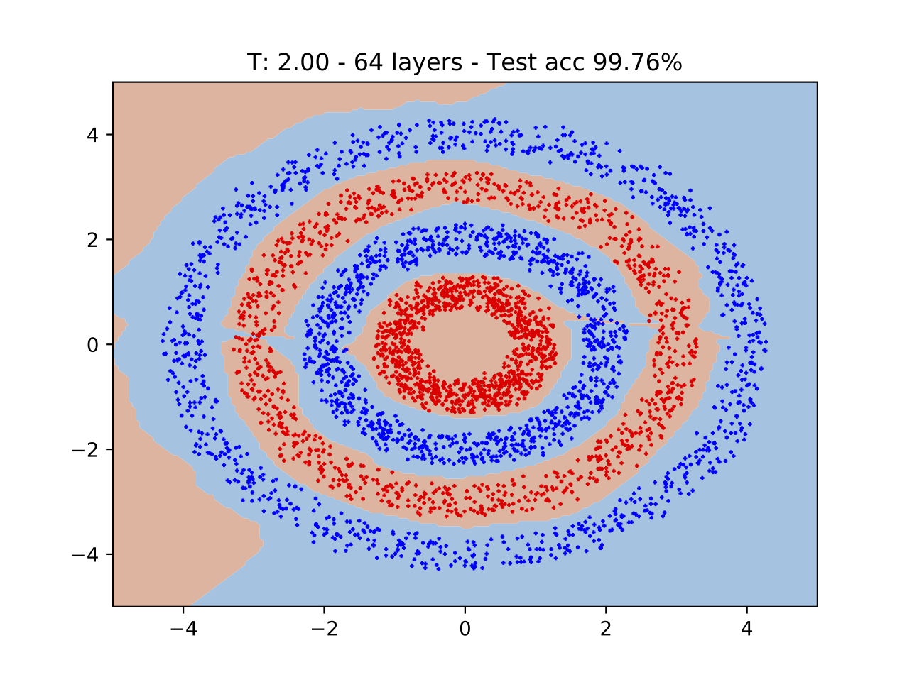
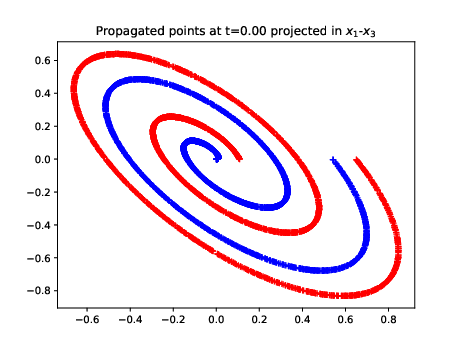
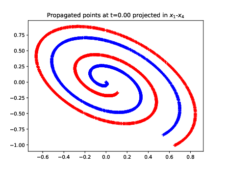
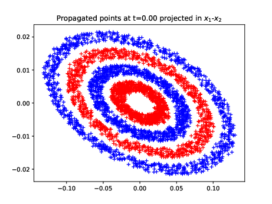
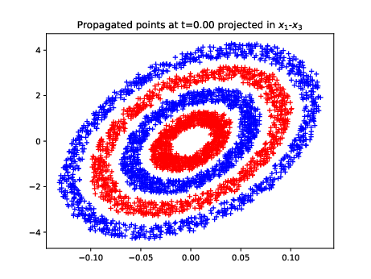
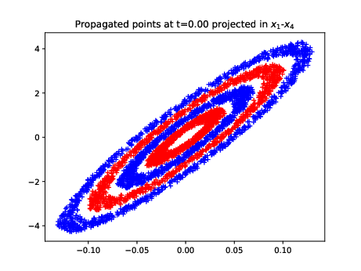
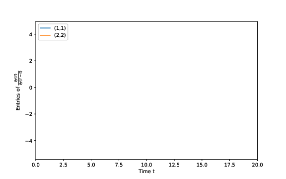

# Hamiltonian Deep Neural Networks

PyTorch implementation of Hamiltonian deep neural networks as presented in ["Hamiltonian Deep Neural Networks Guaranteeing Non-vanishing Gradients by Design"](https://arxiv.org/pdf/2105.13205.pdf).

## Installation

```bash
git clone https://github.com/DecodEPFL/HamiltonianNet.git

cd HamiltonianNet

python setup.py install
```

## Basic usage

2D classification examples:
```bash
./examples/run.py --dataset [DATASET] --model [MODEL]
```
where available values for `DATASET` are `swiss_roll` and `double_moons`.

Distributed training on 2D classification examples:
```bash
./examples/run_distributed.py --dataset [DATASET]
```
where available values for `DATASET` are `swiss_roll` and `double_circles`.

Classification over MNIST dataset:
```bash
./examples/run_MNIST.py --model [MODEL]
```
where available values for `MODEL` are `MS1` and `H1`.


To reproduce the counterexample of Appendix III:
```bash
./examples/gradient_analysis/perturbation_analysis.py
```

## Hamiltonian Deep Neural Networks (H-DNNs)

H-DNNs are obtained after the discretization of an ordinary differential equation (ODE) that represents a time-varying Hamiltonian system.
The time varying dynamics of a Hamiltonian system is given by

<p align="center">
 &ensp; and &ensp; .
</p>

<!--_**y&#775;**(t) = **J**(**y**,t) &part;H(**y**,t)/&part;**y**_ -->

where _**y**(t)_ &isin; &reals;<sup>_n_</sup> represents the state, _H(**y**,t)_: &reals;<sup>_n_</sup> &times; &reals; &#8594; &reals; is the Hamiltonian function and the _n &times; n_ matrix _**J**_, called interconnection matrix, satisfies 
.

After discretization, we have

* H<sub>1</sub>-DNN: &ensp;


* H<sub>2</sub>-DNN: &ensp; 
 

&nbsp;&nbsp;&nbsp;&nbsp;&nbsp;&nbsp;&nbsp;&nbsp;&nbsp;&nbsp;&nbsp;&nbsp;&nbsp;&nbsp;&nbsp;&nbsp;&nbsp;&nbsp;&nbsp;&nbsp;&nbsp;&nbsp;&nbsp;&nbsp; where &nbsp; 

## 2D classification examples
We consider two benchmark classification problems: "Swiss roll" and "Double circles", each of them with two categories and two features.

<p align="center">


</p>

An example of each dataset is shown in the figures above together with the predictions of a trained 64-layer H<sub>1</sub>-DNN (colored regions on the background). For these examples, the two features data is augmented, leading to _**y**_<sub>_k_</sub> &isin; &reals;<sup>4</sup>, &ensp; _k_ = 0,...,64.

Figures below shows the hidden feature vectors &mdash;the states _**y**<sub>k</sub>_&mdash; of all the test data after training. First, a change of basis is performed in order to have the classification hyperplane perpendicular to the first basis vector _**x**<sub>1</sub>_. Then, projections are performed on the new coordinate planes.

<p align="center">



</p>

<p align="center">



</p>

## Counterexample

Previous work conjetured that some classes of H-DNNs avoid exploding gradients when _**y**(t)_ varies arbitrarily slow. The following numerical example shows that, unfortunately, this is not the case.

We consider the simple case, where the underlying ODE is

<p align="center">
<i><b>y&#775;</b>(t) = &epsilon; <b>J</b> </i>  tanh( <i><b>y</b>(t)</i> )
&ensp; &ensp; &ensp; with &ensp;  &ensp;  &ensp; .
</p>

We study the evolution of _**y**(t)_ and _**y**<sub>&gamma;</sub>(t)_, _t &isin; [t<sub>0</sub>, T]_ and _t<sub>0</sub> &isin; [0, T]_, with initial conditions _**y**(t<sub>0</sub>) = **y**<sub>0</sub>_ and _**y**<sub>&gamma;</sub>(t<sub>0</sub>) = **y**<sub>0</sub> &plus; &gamma;**&beta;**_, with _&gamma;_ = 0.05 and _**&beta;**_ the unitary vectors. The initial condition _**y**<sub>0</sub>_ is set randomly, and normalized to have unitary norm.

<p align="center">


</p>

The left Figure shows the time evolution of _**y**(t)_, in blue, and _**y**<sub>&gamma;</sub>(t)_, in orange, when a perturbation is applied at a time _t<sub>0</sub> = T-t_. The nominal initial condition (_**y**(T-t)_) is indicated with a blue circle and the perturbated one (_**y**<sub>&gamma;</sub>(T-t)_) with an orange cross. A zoom is presented on the right side, where a green vector indicates the difference between _**y**<sub>&gamma;</sub>(T)_ and _**y**(T)_.

Figure on the right presents the entries _(1,1)_ and _(2,2)_ of the BSM matrix. Note that the value coincides in sign and magnitud with the green vector.

This numerical experiment confirms that the entries of the BSM matrix (we only show 2 of the 4 entries) diverge as the depth of the network increases (i.e. as the perturbation is introduced further away from the output).


<!--
## H-DNNs

We extend the network structures proposed by [3] and [4] and we include them in a unified and more general model that we call Hamiltonian deep neural networks (H-DNNs). H-DNNs are obrained after the discretization of an ordinary differential equation (ODE) that represents a time-varying Hamiltonian system.

From a system theory perspective, these systems are relevant since they offer a modelling framework for systems based on energy functions. From this approach, a Hamiltonian function represents the total stored energy of the system.

The time varying dynamics of a Hamiltonian system is given by

```math
\dot{y}(t) = J(y,t) \frac{\partial H(y,t)}{\partial y}
```

where $`y(t) \in \mathbb{R}^N`$ represents the state, $`H(y,t): \mathbb{R}^N \times \mathbb{R} \rightarrow \mathbb{R}`$ is the Hamiltonian function and the $`N \times N`$ matrix, called interconnection matrix, satisfies $`J(y,t) = - J^T(y,t)`$ $`\forall t`$.


In this work, we consider Hamiltonian systems based on the energy function

```math
H(y,t) = [\log \cosh (K(t) y(t) + b(t))]^T \boldsymbol{1}
```

where $`\log(\cdot)`$ and $`\cosh(\cdot)`$ are applied element wise, and $`K(t)`$ and $`b(t)`$ are the trainable parameters.

Then, the ODE of Eq. 1 is given by

```math
\dot{y}(t) = J(y,t) K^T(t) \tanh (K(t) y(t) + b(t))
```

After selecting a proper discretization method, we can define different DNN structures based on the ODE of Eq.3.

We implement some DNNs using both forward Euler and semi-implicit Euler discretization, and imposing restictions over $`J`$ and $`K`$. Details can be found in Table 1.


|  Name                         | Restictions | 
| :---:                         | :---:          | 
| MS<sub>1</sub>-DNN | $`K(t) = \begin{bmatrix} 0 & K_0(t) \\ -K_0^T(t) & 0 \\ \end{bmatrix}`$   and   $`J(y,t)K(t) = I`$ | 
| MS<sub>2</sub>-DNN | $`K(t) = -K^T(t)`$   and   $`J(y,t)K(t) = I`$ | 
| MS<sub>3</sub>-DNN | $`K(t) = \begin{bmatrix} 0 & K_1(t) \\ K_2(t) & 0 \\ \end{bmatrix}`$   and   $`J(y,t) = \begin{bmatrix} 0 & I \\ -I & 0 \\ \end{bmatrix}`$ | 
| H<sub>1-J1</sub>-DNN | $`J(y,t) = \begin{bmatrix} 0 & I \\ -I & 0 \end{bmatrix} \\`$ | 
| H<sub>1-J2</sub>-DNN | $`J(y,t) = \begin{bmatrix} 0 & 1 & \dots & 1 \\ -1 & 0 & \dots & 1 \\ \vdots & \vdots & \ddots & \vdots \\ -1 & -1 & \dots & 0 \\ \end{bmatrix}`$ | 
| H<sub>2</sub>-DNN | $`J(y,t) = \begin{bmatrix} 0 & -X^T \\ X & 0 \end{bmatrix} \\`$  and $`K(t) = \begin{bmatrix} K_p(t) & 0 \\ 0 & K_q(t) \\ \end{bmatrix}`$| 


_Remark: MS<sub>i</sub> networks were introduced in [3,4]. We have adapted to match our framework._
-->

## License
This work is licensed under a
[Creative Commons Attribution 4.0 International License][cc-by].

The code DOI is [](https://zenodo.org/badge/latestdoi/371379388).

[![CC BY 4.0][cc-by-image]][cc-by] 

[cc-by]: http://creativecommons.org/licenses/by/4.0/
[cc-by-image]: https://i.creativecommons.org/l/by/4.0/88x31.png
[cc-by-shield]: https://img.shields.io/badge/License-CC%20BY%204.0-lightgrey.svg


## References
[[1]](https://arxiv.org/pdf/2105.13205.pdf)
Clara L. Galimberti, Luca Furieri, Liang Xu and Giancarlo Ferrari Trecate.
"Hamiltonian Deep Neural Networks Guaranteeing Non-vanishing Gradients by Design,"
arXiv:2105.13205, 2021.

[[2]](https://arxiv.org/pdf/2104.13166.pdf)
Clara L. Galimberti, Liang Xu and Giancarlo Ferrari Trecate.
"A unified framework for Hamiltonian deep neural networks,"
The third annual Learning for Dynamics & Control (L4DC) conference, preprint arXiv:2104.13166 available, 2021.

[[3]](https://arxiv.org/pdf/1705.03341.pdf) 
Eldad Haber and Lars Ruthotto.
"Stable architectures for deep neural networks,"
Inverse Problems, vol. 34, p. 014004, Dec 2017.

[[4]](https://www.aaai.org/ocs/index.php/AAAI/AAAI18/paper/download/16517/16577)
Bo Chang, Lili Meng, Eldad Haber, Lars Ruthotto, David Begert and Elliot Holtham.
"Reversible architectures for arbitrarily deep residual neural networks,"
AAAI Conference on Artificial Intelligence, 2018.
